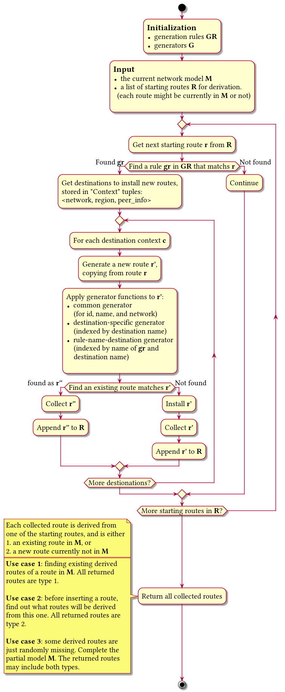

# Intern Project - Declarative Route Derivation Engine

**This is not an officially supported Google product.**

## Overview
Google Cloud Platform features a set of virtual components to facilitate the
network deployment, including virtualized cloud router, firewall, routing table,
network peering, VPN gateway and VPN tunnel, as well as other interconnections 
such as direct connections and public Internet access. Though even simpler in 
configuration and deployment compared with SDN, virtualized components still exhibit subtle 
behavior features which once encountered with, may be hard to analysis and 
reinstate. Existing efforts present in network intent verifications where a 
series of user-specified checks can be launched against the current network 
control plane or data plane to find out whether the current network contains a 
forwarding loop, drops traffic which should be forwarded, etc. 

This work fills the gap between the configuration and verification by providing 
a **derivation engine** to figure out the new data plane based on the current 
one and a proposed set of configuration changes. The derivation focuses on the 
routing table because most, if not all, configuration changes that may cause 
"chain reactions" on the data plane are ones that influencing the routes. 

For easy extension with future features, the derivation engine is designed 
and implemented in a generalized **configuration-based** style. With a fixed 
derivation pipeline as a generalized derivation framework, some pluggable
configurations (being `ProtoBuf`s or `Python` snippets) are loaded as a complete
description of the current behavior of the real GCP under a configuration 
update. The configurations are designed in a declarative style instead of 
imperative style. This way decouples the configuration description and the 
execution of the derivation engine and is thus considered as much easier for
reasoning and debugging. 

## Derivation framework

**<center>Derivation workflow</center>**


**<center>Workflow for match</center>**

## Declarative configurations

The configurations are mainly divided into two categories: generation rules and generators. 

A generation rule is a ProtoBuf message `RouteDerivationRule` in [this file](proto/cloud_network_model.proto). 

Basically, it contains a list of filters and destinations. If any filter exactly matches a route, then the matched route is propagated to all destinations specified in this rule. 

```protobuf
message RouteDerivationRule {
  optional string name = 1;

  // The filter of a route to be applied for this rule.
  // Recommended usage: set `type` or `region` to pick the routes for a single type or region
  // The matching is exact match for all present fields.
  // Can specify many filters and if any filter is an exact match, this whole rule is a match
  //
  // A limited programming ability is provided to specify some predicates based on
  // the Route proto. In each field of the Route proto where the type is "string", use
  // triple grave accent (```) in the beginning to start a Python boolean lambda function
  // body. This lambda has the following implicit parameters:
  // - *route* the route being matched
  // And the return value is converted to a boolean. If exception are raised, consider it
  // as a non-match
  // Example:
  //    filters {
  //      region: "us-west1"
  //    }
  //    and
  //    filters {
  //      region: "```route.region == 'us-west1'"
  //    }
  // Both rules match routes that in region us-west1.
  repeated Route filters = 2;

  // A limited programming ability is provided to specify some predicates based on
  // the Route proto. The predicate is expressed by a Python boolean lambda function body.
  // This lambda has the following implicit parameters:
  // - *route* the route being matched
  //
  // And the return value is converted to a boolean. If exception are raised, consider it
  // as a non-match
  // Example:
  // {
  //   lambda_filters: "route.instance_filter.attributes[0].tag"
  // }
  // This rule matches routes that are assigned with tags.
  repeated string lambda_filters = 3;

  repeated DestinationAndGeneration destinations = 6;
}

```

And the `DestinationAndGeneration` is defined as

```protobuf
message DestinationAndGeneration {
  // The new route are generated in the following priority order:
  // - generated by a series of corresponding Python functions
  // - copied from the original route, and merged from the route_template
  // - copied from the original route
  //
  // The naming convention to access the Python functions are:
  // - all .py files under src/derivation_rules are parsed and only functions are extracted.
  // - the functions should not collide in names
  // - the functions are invoked by name, in the following order:
  //    -- <destination_name>_generator
  //    -- <rule_name>_<destination name>_generator
  //        the rule_name here is the optional name of the matching RouteDerivationRule
  //
  // - each function receives three parameters: route, context, and model
  // - each function modifies the input route, and returns the same route
  // - the context is a destination-specific protobuf defined below as "DestinationContext"
  //
  // A limited programming ability is provided to specify some predicates based on
  // the Route proto. In each field of the Route proto where the type is "string", use
  // triple grave accent (```) in the beginning to start a Python lambda function
  // body. This lambda has the following implicit parameters:
  // - *route* the route being generated
  // - *root_route* the root route
  // - *region* the region to install the route, for dynamic and peering_dynamic routes.
  //
  // And the return value is converted to a string. If exception are raised, skip this field
  // Example:
  //    route_template {
  //      region: "```root_route.region"
  //    }
  optional Route route_template = 4;

  // The destinations have fixed builtin semantics in destination selection and actions.
  //   - VPC_PEERS:                  all active peering VPC networks
  //
  //   - VPC_PEERS_CUSTOM_ROUTING:   all active peering VPC networks that import custom routes
  //                                 from the route's network, and simultaneously, the route's
  //                                 network export custom routes to them.
  //
  //   - REGIONS_OF_VPC_PEERS_CUSTOM_ROUTING: all active peering VPC networks that import 
  //                                 custom routes from the route's network, and simultaneously,
  //                                 the route's network export custom routes to them. The route
  //                                 is exported to all regions that the network has presence.
  //
  //   - BGP_PEERS:                  all networks that hold one or more *live* BGP session with the current network, and
  //                                 the involved VPN tunnels in current network enable subnet advertising
  //
  //   - OTHER_REGIONS_WHEN_GLOBAL_ROUTING:   all regions other than the route's region, when the current network enables
  //                                          global routing
  //
  // Some fixed actions are bound to each destination as part of the semantics of the destination.
  // These semantics are written as rules
  // For all:
  // - set name, id, url
  // - update the *instance_filter.network*
  //
  // For VPC peering:
  // - update *next_hop_peering*
  // - delete other next hops
  // - change the route type to the corresponding peering type
  //
  // For BGP peering:
  // - fill the field "region"
  // - update *next_hop_tunnel*
  // - delete other next hops
  enum Destination {
    // VPC_PEERS works as a short cut for VPC_PEERS_NO_CUSTOM_ROUTING and VPC_PEERS_CUSTOM_ROUTING. It is first internally
    // translated to VPC_PEERS_NO_CUSTOM_ROUTING and VPC_PEERS_CUSTOM_ROUTING, before any derivation process
    VPC_PEERS = 0;
    VPC_PEERS_CUSTOM_ROUTING = 2;
    REGIONS_OF_VPC_PEERS_CUSTOM_ROUTING = 1;
    BGP_PEERS = 3;
    OTHER_REGIONS_WHEN_GLOBAL_ROUTING = 4;
  }

  required Destination destination = 6;

  message DestinationContext {
    required string network = 1;
    // for regional routes
    optional string region = 2;
    // the vpc peering, or the vpn tunnel used in BGP peering
    optional string peer_info = 3;
  }
}
```

The generators are Python functions that are responsible to generate the derived route based on the origional route, the current network, and the generation context. These generator functions contain logics that are easy to express in Python while difficult in ProtoBuf. 

The generation of a single derived route is divided into several steps, calling generators from the most generalized to the most specific, identified based on their names. The common generator is always called, while the function shares the name with the current generation destination is called later, and the function with the rule name is called last. Because a later called function has a clearer view and the ability to override the fields set by previous functions, the most specific function has the highest priority. 


## Currently supported derivation rules

### Overview: 
-	VPN: can advertise subnet routes and user specified prefixes. Static/dynamic routes are not advertised. 
-	Peering: will export subnet routes. can export custom routes (with no tags, not to Internet)
-	Dynamic/static routes: only propagated for peering. Dynamic routes depend on the regional configurations. 

### Detailed rules for propagation via BGP and VPC peering
-	A VPN tunnel might not advertise subnet routes
-	A VPN tunnel always accepts all learned routes
-	A VPC always exports subnet routes
-	A VPC always accepts subnet routes
-	A VPC might not export custom routes
-	A VPC might not import custom routes

### Possible propagation paths of routes or prefixes
-	**A static route (with tags or to the Internet)**
    *no more propagation*
-	**A static route (with no tags and not to Internet)**
    *exported to all VPC peers as <ins>peering static routes</ins>*
-	**A subnet route**
    *exported to all VPC peers as <ins>peering subnet routes</ins> and VPN tunnels as <ins>BGP prefixes</ins>*
-	**A custom prefix in a VPN tunnel**
    *learned by the peering VPN tunnel as a <ins>BGP prefix</ins>*
    - <small>This is not a route, and thus not configured with a rule</small>
-	**A dynamic route**: 
    *exported to all VPC peers as <ins>peering dynamic routes</ins>*

-	**A BGP prefix**: depending on the routing mode of its network
    - [`regional mode`] *installed in the region of the VPN tunnel as a <ins>dynamic route</ins>*
    - [`global mode`] *installed in all regions as <ins>dynamic routes</ins> (with adjusted regional cost)*

-	**A peering subnet route**
    *no more propagation*
-	**A peering static route**
    *no more propagation*
-	**A peering dynamic route**
    *no more propagation*

## Use cases
### Derivation after configuration change

Dynamic routes
1. In a BGP session, an IP prefix is advertised or withdrawn from the BGP peer
2. A VPN tunnel is removed (remove learned routes and derived routes)
3. A custom IP prefix is added to or deleted from the BGP session of a VPN Tunnel, while the other end is also in GCP
4. The MED of a BGP session is changed, then the priorities of custom route and dynamic routes are all updated 

Subnet routes
1. A subnet is added, (of course) with new IP ranges, or deleted. 
2. An IP range is added to a subnet (the current GCP API does not support delete, but deleting is supported and tested in this derivation engine)
3. An IP range of a subnet is changed (in the current GCP API, the IP range can only be larger, and only the primary range is adjustable)

Static routes
1. A static route is added or removed
2. The priority, tags, etc. of a static route is changed (the current GCP API does not support modification, but this feature is supported and tested in this derivation engine)

### Debugging the root cause of an unexpected routing behavior
All routes in the data plane model, together with the derivation relation as the directed edges, form a forester, where the root of each tree is the root route of all its offspring routes. 
Many unexpected routing behaviors are caused by some undesired route. The derivation engine can help find the root route that generates an unexpected route, to faster the root-cause process for users (being it a end customer or some automation systems). 

### Find out why a route is not generated
The user may expect a route to be inserted based on the current configuration, but in GCP, the route is not inserted. This derivation engine can serve finding the cause by providing logs for the reference of the user. 

## Run demo
The demos are also the test cases. To run it on a Ubuntu machine, please execute the following commands in shell:

```bash
sudo pip3 install protobuf
sudo apt install protobuf-compiler

git clone https://github.com/googleinterns/connectivity-test
cd connectivity-test

protoc --proto_path=./ --python_out=./ proto/*.proto

python3 -m unittest src.declarative_derivation_test.TestDataPlane
```

Currently 11 tests associated with the use cases are carried out in sequence.  
